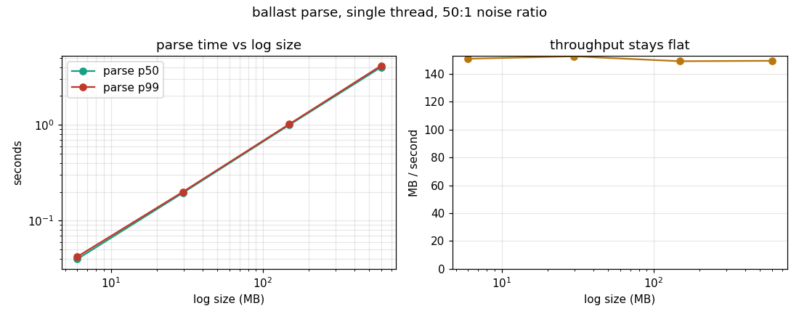

# ballast ⚓


Finds the skew that makes your Spark jobs list.

A Spark stage is only as fast as its slowest task, and in every aging
pipeline there is a stage where one hot key hands one task half the
shuffle. The other 199 slots finish in a minute and sit, paid for and
idle, while the straggler grinds. The Spark UI shows you this one stage at
a time, if you know to look. ballast reads the event logs Spark already
writes (`spark.eventLog.enabled=true`, which your history server needs
anyway) and reads across all of it. No Spark install, no cluster access.

```bash
pip install -e .
ballast analyze --log /path/to/eventlog
```

```
  s  4 shuffle join at Enrich.scala:88
       data_skew straggler
       drag 439.7s (wall 480.0s, median 40.3s over 200 tasks); read skew 160x median: repartition or salt the hot key

  s 11 map at Score.scala:19
       straggler
       drag 90.2s (wall 108.0s, median 17.8s over 100 tasks); reads are uniform (1.1x): suspect a slow node or GC, not a hot key

  s  7 sortWithinPartitions at Dedup.scala:31
       spill
       drag 11.5s (wall 68.5s, median 57.0s over 120 tasks); spilled 69.2GB

  s  9 aggregate at Rollup.scala:52
       gc_pressure
       drag 6.3s (wall 35.8s, median 29.6s over 80 tasks); GC 25% of task time
```

That is real output from `ballast demo`, which fabricates an event log
from a job having a bad day (13 stages, 1,415 tasks, five problems planted
in known places) and finds exactly the planted set, pinned by a test.

## The one distinction that matters

Two stages above have a straggler. Only one has a hot key.

Stage 4's slowest task read **160x** the median shuffle bytes: that is
data skew, and the fix is repartitioning or salting the key. Stage 11's
slowest task read the same bytes as everyone else (1.1x) and still took
6x as long: that is a slow node, a GC pause, or noisy neighbors, and
salting keys there wastes a sprint. Tools that report "straggler" without
naming the cause send engineers to fix the wrong thing; ballast reports
the read-skew ratio next to every straggler so the diagnosis travels with
the finding.

## Drag: the headline number

Per stage, **drag = slowest task minus median task**, in wall-clock
seconds: the time the stage spent waiting on its slowest task beyond a
typical one. It is a deliberately conservative, single-wave lower bound.
It ignores multi-wave scheduling (where fixing skew saves more) and never
multiplies by idle slots (which would inflate). The demo job carries
564.3s of drag; when ballast says that, the real prize is usually bigger.
Under-claiming is the correct failure mode for a diagnostic.

## The checks

| Finding | Fires when | The fix it points at |
|---|---|---|
| `straggler` | slowest task >= 4x median duration (stages of 8+ tasks) | depends on the next row |
| `data_skew` | ...and slowest read >= 4x median shuffle bytes | repartition, salt the hot key, AQE skew join |
| `spill` | any disk or memory bytes spilled | more partitions or more executor memory |
| `gc_pressure` | stage GC time >= 15% of task time | executor sizing, object churn |
| `task_failures` | failed attempts (Spark retried them) | flaky infra or flaky data; look before it stops being retryable |

Thresholds are flags with defaults, not magic. `analyze` exits 1 when any
stage carries skew or a straggler, so a scheduled run can flag regressions;
this repo's own CI asserts the demo exits 1, because the demo plants skew
and finding it is the point.

## Performance

Measured by this repo's benchmark (`make bench`): single thread, 15
repeats per size, synthetic logs with a realistic 50:1 noise ratio around
the task events (real logs are mostly block updates and executor metrics
ballast never lifts).

| Log | Lines | Parse p50 | Parse p99 | Analyze p50 | Throughput |
|---:|---:|---:|---:|---:|---:|
| 6.0MB (1k tasks) | 51,003 | 39.6ms | 41.9ms | 0.39ms | 150.8 MB/s |
| 29.8MB (5k tasks) | 255,011 | 195.6ms | 200.1ms | 1.76ms | 152.5 MB/s |
| 149.2MB (25k tasks) | 1,275,051 | 1.00s | 1.02s | 8.75ms | 149.0 MB/s |
| 596.8MB (100k tasks) | 5,100,201 | 4.00s | 4.14s | 34.45ms | 149.3 MB/s |



A 600MB event log parses in 4 seconds; analysis is a rounding error on
top. Results are committed (`benchmark/results/`) because the README
should not claim what the repo cannot reproduce.

## Real bugs, kept honest

The first benchmark run caught the parser lying. Its docstring claimed
noise was "skipped without parsing beyond the Event field"; the code
json.loads-ed every one of the ~98% noise lines anyway, at 52.8 MB/s. The
fix is a substring pre-filter on the three wanted event names: an event's
type appears verbatim in its line, so there are no false negatives, and
false positives still face the authoritative check after parsing. 52.8 ->
150 MB/s; the 597MB log went from 11.6s to 4.0s. The contract narrowed
deliberately (corrupt noise is now skipped; corruption in lines ballast
reads still raises with its line number) and the regression test pins
both halves. The commit message tells the same story the git log does.

## What this is not

- Not a Spark UI replacement. The UI is per-stage and interactive; ballast
  is cross-job and scriptable. Use the UI to dig into what ballast flags.
- Not a tuner. It will not set `spark.sql.shuffle.partitions` for you; it
  tells you which stage is why the job is slow and what kind of fix fits.
- Not a streaming consumer. It reads completed event logs. Point it at the
  history server's log directory in a nightly cron and gate on exit code.

## Development

```bash
make install   # editable install with dev extras
make test      # 12 tests, all fast, no infra
make lint      # ruff
make demo      # a job having a bad day, diagnosed
make bench     # measure throughput on your machine
```

## Easter egg

There is a `ballast shanty` command. Heave away.

MIT. Built by [Prasannakumar Kasindala](https://github.com/kasindala-prasannakumar).
